[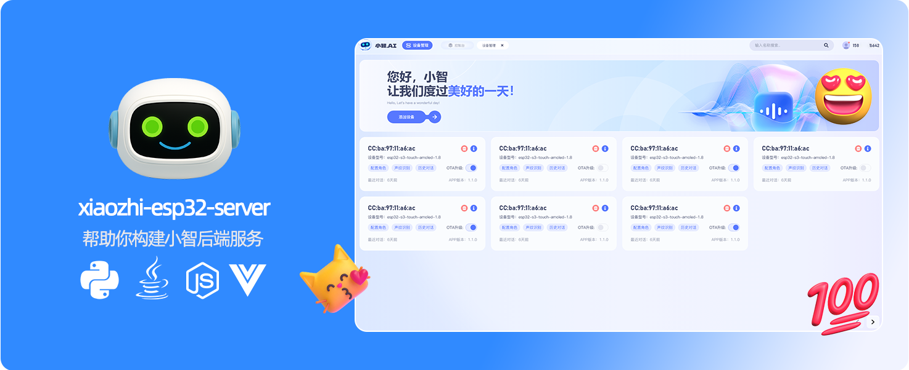](https://github.com/xinnan-tech/xiaozhi-esp32-server)

<h1 align="center">Servicio Backend Xiaozhi xiaozhi-esp32-server</h1>

<p align="center">
Este proyecto se basa en la teoría y tecnología de inteligencia simbiótica hombre-máquina para desarrollar sistemas de hardware y software de terminales inteligentes<br/>proporcionando servicios backend para el proyecto de hardware inteligente de código abierto
<a href="https://github.com/78/xiaozhi-esp32">xiaozhi-esp32</a><br/>
Implementado utilizando Python, Java y Vue de acuerdo con el <a href="https://ccnphfhqs21z.feishu.cn/wiki/M0XiwldO9iJwHikpXD5cEx71nKh">Protocolo de Comunicación Xiaozhi</a><br/>
Soporte para protocolo MQTT+UDP, protocolo Websocket, punto de acceso MCP, reconocimiento de huella vocal y base de conocimientos
</p>

<p align="center">
<a href="./docs-es/FAQ.md">Preguntas Frecuentes (FAQ)</a>
· <a href="https://github.com/xinnan-tech/xiaozhi-esp32-server/issues">Reportar Problemas</a>
· <a href="./README.md#%E9%83%A8%E7%BD%B2%E6%96%87%E6%A1%A3">Docs de Despliegue</a>
· <a href="https://github.com/xinnan-tech/xiaozhi-esp32-server/releases">Notas de Versión</a>
</p>

<p align="center">
  <a href="./README.md"></a>
  <a href="./README_en.md"></a>
  <a href="./README_es.md"></a>
  <a href="./README_vi.md"></a>
  <a href="./README_de.md"></a>
  <a href="./README_pt_BR.md"></a>
  <a href="https://github.com/xinnan-tech/xiaozhi-esp32-server/releases">
    
  </a>
  <a href="https://github.com/xinnan-tech/xiaozhi-esp32-server/blob/main/LICENSE">
    
  </a>
  <a href="https://github.com/xinnan-tech/xiaozhi-esp32-server">
    
  </a>
</p>

<p align="center">
Liderado por el Equipo del Profesor Siyuan Liu (Universidad de Tecnología del Sur de China)
</br>
刘思源教授团队主导研发（华南理工大学）
</br>

</p>

---

## Usuarios Objetivo 👥

Este proyecto requiere dispositivos de hardware ESP32 para funcionar. Si has comprado hardware relacionado con ESP32, te has conectado con éxito al servicio backend desplegado por Brother Xia y quieres construir tu propio servicio backend `xiaozhi-esp32` de forma independiente, entonces este proyecto es perfecto para ti.

¿Quieres ver los efectos de uso? Haz clic en los videos a continuación 🎥

<table>
  <tr>
    <td>
        <a href="https://www.bilibili.com/video/BV1FMFyejExX" target="_blank">
         <picture>
           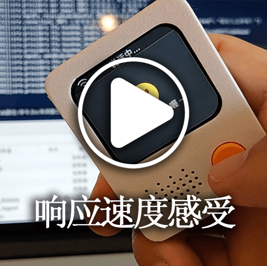
         </picture>
        </a>
    </td>
    <td>
        <a href="https://www.bilibili.com/video/BV1vchQzaEse" target="_blank">
         <picture>
           
         </picture>
        </a>
    </td>
    <td>
        <a href="https://www.bilibili.com/video/BV1C1tCzUEZh" target="_blank">
         <picture>
           
         </picture>
        </a>
    </td>
    <td>
        <a href="https://www.bilibili.com/video/BV1zUW5zJEkq" target="_blank">
         <picture>
           
         </picture>
        </a>
    </td>
    <td>
        <a href="https://www.bilibili.com/video/BV1Exu3zqEDe" target="_blank">
         <picture>
           
         </picture>
        </a>
    </td>
  </tr>
  <tr>
    <td>
        <a href="https://www.bilibili.com/video/BV1pNXWYGEx1" target="_blank">
         <picture>
           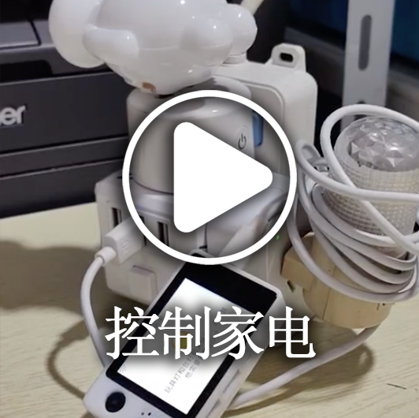
         </picture>
        </a>
    </td>
    <td>
        <a href="https://www.bilibili.com/video/BV1ZQKUzYExM" target="_blank">
         <picture>
           
         </picture>
        </a>
    </td>
    <td>
      <a href="https://www.bilibili.com/video/BV1TJ7WzzEo6" target="_blank">
         <picture>
           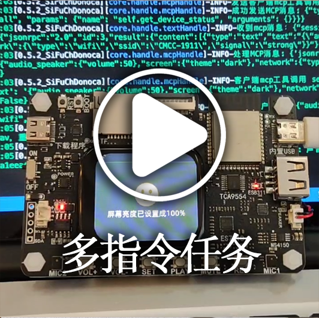
         </picture>
        </a>
    </td>
    <td>
        <a href="https://www.bilibili.com/video/BV1VC96Y5EMH" target="_blank">
         <picture>
           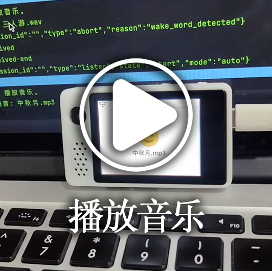
         </picture>
        </a>
    </td>
    <td>
        <a href="https://www.bilibili.com/video/BV1Z8XuYZEAS" target="_blank">
         <picture>
           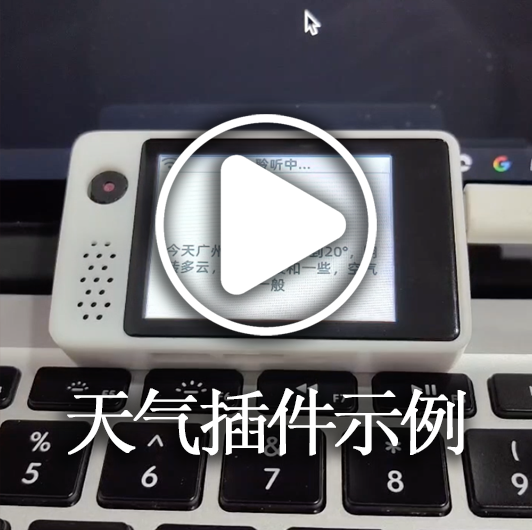
         </picture>
        </a>
    </td>
  </tr>
  <tr>
    <td>
      <a href="https://www.bilibili.com/video/BV12J7WzBEaH" target="_blank">
         <picture>
           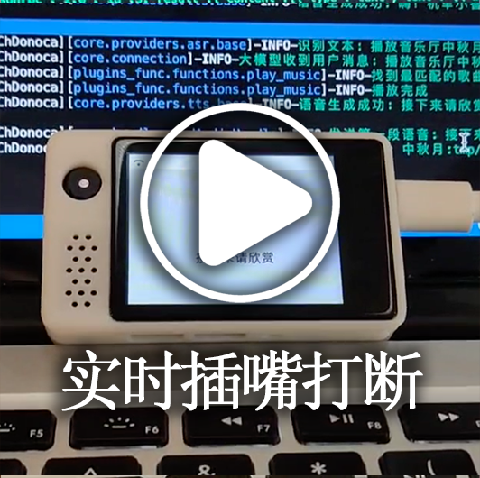
         </picture>
        </a>
    </td>
    <td>
      <a href="https://www.bilibili.com/video/BV1Co76z7EvK" target="_blank">
         <picture>
           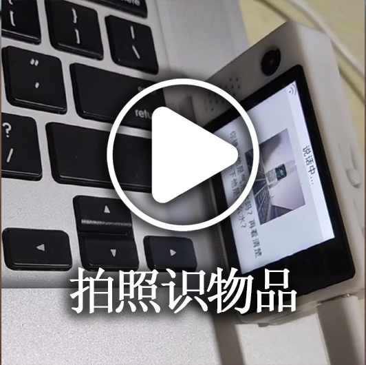
         </picture>
        </a>
    </td>
    <td>
        <a href="https://www.bilibili.com/video/BV1CDKWemEU6" target="_blank">
         <picture>
           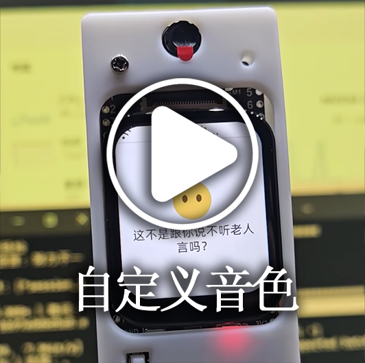
         </picture>
        </a>
    </td>
    <td>
        <a href="https://www.bilibili.com/video/BV12yA2egEaC" target="_blank">
         <picture>
           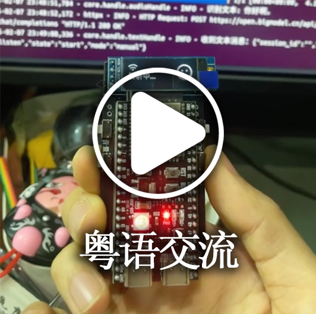
         </picture>
        </a>
    </td>
    <td>
        <a href="https://www.bilibili.com/video/BV17LXWYvENb" target="_blank">
         <picture>
           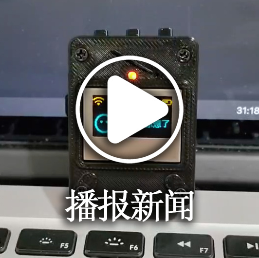
         </picture>
        </a>
    </td>
  </tr>
</table>

---

## Advertencias ⚠️

1. Este proyecto es software de código abierto. Este software no tiene asociación comercial con ningún proveedor de servicios API de terceros (incluyendo pero no limitado a reconocimiento de voz, modelos grandes, síntesis de voz y otras plataformas) con las que se conecta, y no proporciona ningún tipo de garantía para su calidad de servicio o seguridad financiera. Se recomienda que los usuarios prioricen a los proveedores de servicios con las licencias comerciales pertinentes y lean cuidadosamente sus acuerdos de servicio y políticas de privacidad. Este software no aloja ninguna clave de cuenta, no participa en flujos de fondos y no asume el riesgo de pérdidas de fondos de recarga.

2. La funcionalidad de este proyecto no está completa y no ha pasado la evaluación de seguridad de red. Por favor, no lo utilices en entornos de producción. Si despliegas este proyecto con fines de aprendizaje en un entorno de red pública, asegúrate de contar con las medidas de protección necesarias.

---

## Documentación de Despliegue

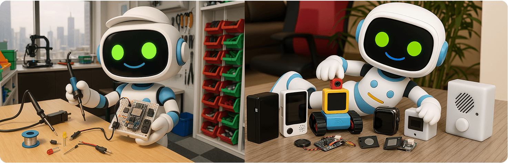

Este proyecto proporciona dos métodos de despliegue. Por favor, elige según tus necesidades específicas:

#### 🚀 Selección del Método de Despliegue
| Método de Despliegue | Características | Escenarios Aplicables | Docs de Despliegue | Requisitos de Configuración | Tutoriales en Video | 
|---------|------|---------|---------|---------|---------|
| **Instalación Simplificada** | Diálogo inteligente, gestión de agente único | Entornos de baja configuración, datos almacenados en archivos de configuración, no requiere base de datos | [①Versión Docker](./docs-es/Deployment.md#%E6%96%B9%E5%BC%8F%E4%B8%80docker%E5%8F%AA%E8%BF%90%E8%A1%8Cserver) / [②Despliegue de Código Fuente](./docs-es/Deployment.md#%E6%96%B9%E5%BC%8F%E4%BA%8C%E6%9C%AC%E5%9C%B0%E6%BA%90%E7%A0%81%E5%8F%AA%E8%BF%90%E8%A1%8Cserver)| 2 núcleos 4GB si usas `FunASR`, 2 núcleos 2GB si todas las APIs | - | 
| **Instalación de Módulo Completo** | Diálogo inteligente, gestión multiusuario, gestión multiagente, operación de interfaz de consola inteligente | Experiencia de funcionalidad completa, datos almacenados en base de datos |[①Versión Docker](./docs-es/Deployment_all.md#%E6%96%B9%E5%BC%8F%E4%B8%80docker%E8%BF%90%E8%A1%8C%E5%85%A8%E6%A8%A1%E5%9D%97) / [②Despliegue de Código Fuente](./docs-es/Deployment_all.md#%E6%96%B9%E5%BC%8F%E4%BA%8C%E6%9C%AC%E5%9C%B0%E6%BA%90%E7%A0%81%E8%BF%90%E8%A1%8C%E5%85%A8%E6%A8%A1%E5%9D%97) / [③Tutorial de Auto-actualización de Despliegue de Código Fuente](./docs-es/dev-ops-integration.md) | 4 núcleos 8GB si usas `FunASR`, 2 núcleos 4GB si todas las APIs| [Tutorial en Video de Inicio de Código Fuente Local](https://www.bilibili.com/video/BV1wBJhz4Ewe) |

Para preguntas frecuentes y tutoriales relacionados, consulta [este enlace](./docs-es/FAQ.md)

> 💡 Nota: A continuación se muestra una plataforma de prueba desplegada con el código más reciente. Puedes grabarla y probarla si es necesario. Usuarios concurrentes: 6, los datos se borrarán diariamente.

```
Dirección de la Consola de Control Inteligente: https://2662r3426b.vicp.fun
Dirección de la Consola de Control Inteligente (H5): https://2662r3426b.vicp.fun/h5/index.html

Herramienta de Prueba de Servicio: https://2662r3426b.vicp.fun/test/
Dirección de la Interfaz OTA: https://2662r3426b.vicp.fun/xiaozhi/ota/
Dirección de la Interfaz Websocket: wss://2662r3426b.vicp.fun/xiaozhi/v1/
```

#### 🚩 Descripción de Configuración y Recomendaciones
> [!Note]
> Este proyecto proporciona dos esquemas de configuración:
> 
> 1. `Ajustes Gratuitos de Nivel de Entrada`: Adecuado para uso personal y doméstico, todos los componentes utilizan soluciones gratuitas, no se requiere pago adicional.
> 
> 2. `Configuración de Transmisión (Streaming)`: Adecuado para demostraciones, capacitación, escenarios con más de 2 usuarios concurrentes, etc. Utiliza tecnología de procesamiento de transmisión para una velocidad de respuesta más rápida y una mejor experiencia.
> 
> A partir de la versión `0.5.2`, el proyecto admite la configuración de transmisión. En comparación con las versiones anteriores, la velocidad de respuesta mejora aproximadamente `2.5 segundos`, mejorando significativamente la experiencia del usuario.

| Nombre del Módulo | Ajustes Gratuitos de Nivel de Entrada | Configuración de Transmisión |
|:---:|:---:|:---:|
| ASR (Reconocimiento de Voz) | FunASR (Local) | 👍XunfeiStreamASR (Transmisión Xunfei) |
| LLM (Modelo Grande) | glm-4-flash (Zhipu) | 👍qwen-flash (Alibaba Bailian) |
| VLLM (Modelo Grande de Visión) | glm-4v-flash (Zhipu) | 👍qwen2.5-vl-3b-instructh (Alibaba Bailian) |
| TTS (Síntesis de Voz) | ✅LinkeraiTTS (Transmisión Lingxi) | 👍HuoshanDoubleStreamTTS (Transmisión Volcano) |
| Intent (Reconocimiento de Intención) | function_call (Llamada a función) | function_call (Llamada a función) |
| Memory (Función de Memoria) | mem_local_short (Memoria local a corto plazo) | mem_local_short (Memoria local a corto plazo) |

Si te preocupa la latencia de cada componente, consulta el [Informe de Prueba de Rendimiento de Componentes de Xiaozhi](https://github.com/xinnan-tech/xiaozhi-performance-research) y realiza pruebas en tu propio entorno siguiendo los métodos de prueba del informe.

#### 🔧 Herramientas de Prueba
Este proyecto proporciona las siguientes herramientas de prueba para ayudarte a verificar el sistema y elegir modelos adecuados:

| Nombre de la Herramienta | Ubicación | Método de Uso | Descripción de Función |
|:---:|:---|:---:|:---:|
| Herramienta de Prueba de Interacción de Audio | main》xiaozhi-server》test》test_page.html | Abrir directamente con Google Chrome | Prueba las funciones de reproducción y recepción de audio, verifica si el procesamiento de audio del lado de Python es normal |
| Herramienta de Prueba de Respuesta del Modelo | main》xiaozhi-server》performance_tester.py | Ejecutar `python performance_tester.py` | Prueba la velocidad de respuesta de cuatro módulos principales: ASR (reconocimiento de voz), LLM (modelo grande), VLLM (modelo de visión), TTS (síntesis de voz) |

> 💡 Nota: Al probar la velocidad del modelo, solo se probarán los modelos con claves configuradas.

---
## Lista de Características ✨
### Implementado ✅

| Módulo de Características | Descripción |
|:---:|:---|
| Arquitectura Principal | Basada en la [puerta de enlace MQTT+UDP](https://github.com/xinnan-tech/xiaozhi-esp32-server/blob/main/docs-es/mqtt-gateway-integration.md), servidores WebSocket y HTTP, proporciona un sistema completo de gestión de consola y autenticación |
| Interacción de Voz | Admite ASR de transmisión (reconocimiento de voz), TTS de transmisión (síntesis de voz), VAD (detección de actividad de voz), admite reconocimiento de múltiples idiomas y procesamiento de voz |
| Reconocimiento de Huella Vocal | Admite el registro, gestión y reconocimiento de huella vocal de múltiples usuarios, se procesa en paralelo con ASR, reconocimiento de identidad del hablante en tiempo real y se pasa al LLM para respuestas personalizadas |
| Diálogo Inteligente | Admite múltiples LLM (modelos de lenguaje grande), implementa el diálogo inteligente |
| Percepción Visual | Admite múltiples VLLM (modelos grandes de visión), implementa la interacción multimodal |
| Reconocimiento de Intención | Admite el reconocimiento de intención por LLM, llamada a funciones Function Call, proporciona un mecanismo de procesamiento de intención basado en plugins |
| Sistema de Memoria | Admite memoria local a corto plazo, memoria de interfaz mem0ai, memoria inteligente PowerMem, con funcionalidad de resumen de memoria |
| Base de Conocimientos | Admite la base de conocimientos RAGFlow, lo que permite al LLM juzgar si debe programar la base de conocimientos después de recibir la pregunta del usuario y luego responder a la pregunta |
| Llamada a Herramientas | Admite el protocolo IOT del cliente, protocolo MCP del cliente, protocolo MCP del servidor, protocolo de punto final MCP, funciones de herramientas personalizadas |
| Envío de Comandos | Admite el envío de comandos MCP a dispositivos ESP32 a través del protocolo MQTT desde la Consola Inteligente |
| Backend de Gestión | Proporciona interfaz de gestión Web, admite gestión de usuarios, configuración del sistema y gestión de dispositivos; admite visualización en chino simplificado, chino tradicional e inglés |
| Herramientas de Prueba | Proporciona herramientas de prueba de rendimiento, herramientas de prueba de modelos de visión y herramientas de prueba de interacción de audio |
| Soporte de Despliegue | Admite el despliegue de Docker y el despliegue local, proporciona una gestión completa de archivos de configuración |
| Sistema de Plugins | Admite extensiones de plugins funcionales, desarrollo de plugins personalizados y carga en caliente de plugins |

### En Desarrollo 🚧

Para conocer el progreso específico del plan de desarrollo, [haz clic aquí](https://github.com/users/xinnan-tech/projects/3). Para preguntas frecuentes y tutoriales relacionados, consulta [este enlace](./docs-es/FAQ.md)

Si eres desarrollador de software, aquí tienes una [Carta Abierta a los Desarrolladores](docs-es/contributor_open_letter.md). ¡Bienvenido a unirte!

---

## Ecosistema del Producto 👬
Xiaozhi es un ecosistema. Al usar este producto, también puedes consultar otros [proyectos excelentes](https://github.com/78/xiaozhi-esp32/blob/main/README_zh.md#%E7%9B%B8%E5%85%B3%E5%BC%80%E6%BA%90%E9%A1%B9%E7%9B%AE) en este ecosistema

---

## Lista de Plataformas/Componentes Soportados 📋
### Modelos de Lenguaje LLM

| Método de Uso | Plataformas Soportadas | Plataformas Gratuitas |
|:---:|:---:|:---:|
| Llamadas a la interfaz de OpenAI | Alibaba Bailian, Volcano Engine, DeepSeek, Zhipu, Gemini, iFLYTEK | Zhipu, Gemini |
| Llamadas a la interfaz de Ollama | Ollama | - |
| Llamadas a la interfaz de Dify | Dify | - |
| Llamadas a la interfaz de FastGPT | FastGPT | - |
| Llamadas a la interfaz de Coze | Coze | - |
| Llamadas a la interfaz de Xinference | Xinference | - |
| Llamadas a la interfaz de HomeAssistant | HomeAssistant | - |

De hecho, cualquier LLM que admita llamadas a la interfaz de OpenAI puede integrarse y utilizarse.

---

### Modelos de Visión VLLM

| Método de Uso | Plataformas Soportadas | Plataformas Gratuitas |
|:---:|:---:|:---:|
| Llamadas a la interfaz de OpenAI | Alibaba Bailian, Zhipu ChatGLMVLLM | Zhipu ChatGLMVLLM |

De hecho, cualquier VLLM que admita llamadas a la interfaz de OpenAI puede integrarse y utilizarse.

---

### Síntesis de Voz TTS

| Método de Uso | Plataformas Soportadas | Plataformas Gratuitas |
|:---:|:---:|:---:|
| Llamadas a la interfaz | EdgeTTS, iFLYTEK, Volcano Engine, Tencent Cloud, Alibaba Cloud y Bailian, CosyVoiceSiliconflow, TTS302AI, CozeCnTTS, GizwitsTTS, ACGNTTS, OpenAITTS, Lingxi Streaming TTS, MinimaxTTS | Lingxi Streaming TTS, EdgeTTS, CosyVoiceSiliconflow (parcial) |
| Servicios locales | FishSpeech, GPT_SOVITS_V2, GPT_SOVITS_V3, Index-TTS, PaddleSpeech | Index-TTS, PaddleSpeech, FishSpeech, GPT_SOVITS_V2, GPT_SOVITS_V3 |

---

### Detección de Actividad de Voz VAD

| Tipo | Nombre de la Plataforma | Método de Uso | Modelo de Precios | Notas |
|:---:|:---------:|:----:|:----:|:--:|
| VAD | SileroVAD | Uso local | Gratis | |

---

### Reconocimiento de Voz ASR

| Método de Uso | Plataformas Soportadas | Plataformas Gratuitas |
|:---:|:---:|:---:|
| Uso local | FunASR, SherpaASR | FunASR, SherpaASR |
| Llamadas a la interfaz | FunASRServer, Volcano Engine, iFLYTEK, Tencent Cloud, Alibaba Cloud, Baidu Cloud, OpenAI ASR | FunASRServer |

---

### Reconocimiento de Huella Vocal

| Método de Uso | Plataformas Soportadas | Plataformas Gratuitas |
|:---:|:---:|:---:|
| Uso local | 3D-Speaker | 3D-Speaker |

---

### Almacenamiento de Memoria

| Tipo | Nombre de la Plataforma | Método de Uso | Modelo de Precios | Notas |
|:------:|:---------------:|:----:|:---------:|:--:|
| Memoria | mem0ai | Llamadas a la interfaz | Cuota de 1000 veces/mes | |
| Memoria | [powermem](./docs-es/powermem-integration.md) | Resumen local | Depende de LLM y DB | Código abierto OceanBase, admite recuperación inteligente |
| Memoria | mem_local_short | Resumen local | Gratis | |
| Memoria | nomem | Modo sin memoria | Gratis | |

---

### Reconocimiento de Intención

| Tipo | Nombre de la Plataforma | Método de Uso | Modelo de Precios | Notas |
|:------:|:-------------:|:----:|:-------:|:---------------------:|
| Intención | intent_llm | Llamadas a la interfaz | Basado en precios de LLM | Reconoce la intención a través de modelos grandes, gran generalización |
| Intención | function_call | Llamadas a la interfaz | Basado en precios de LLM | Completa la intención mediante llamadas a funciones de modelos grandes, velocidad rápida, buen efecto |
| Intención | nointent | Modo sin intención | Gratis | No realiza reconocimiento de intención, devuelve directamente el resultado del diálogo |

---

### Generación Aumentada por Recuperación RAG

| Tipo | Nombre de la Plataforma | Método de Uso | Modelo de Precios | Notas |
|:------:|:-------------:|:----:|:-------:|:---------------------:|
| RAG | ragflow | Llamadas a la interfaz | Cobrado según los tokens consumidos para el recorte y la segmentación de palabras | Utiliza la función de generación aumentada por recuperación de RagFlow para proporcionar respuestas de diálogo más precisas |

---

## Agradecimientos 🙏

| Logo | Proyecto/Empresa | Descripción |
|:---:|:---:|:---|
|  | [Bailing Voice Dialogue Robot](https://github.com/wwbin2017/bailing) | Este proyecto está inspirado en [Bailing Voice Dialogue Robot](https://github.com/wwbin2017/bailing) e implementado sobre su base |
|  | [Tenclass](https://www.tenclass.com/) | Gracias a [Tenclass](https://www.tenclass.com/) por formular protocolos de comunicación estándar, soluciones de compatibilidad con múltiples dispositivos y demostraciones de práctica de escenarios de alta concurrencia para el ecosistema Xiaozhi; proporcionando soporte de documentación técnica de enlace completo para este proyecto |
|  | [Xuanfeng Technology](https://github.com/Eric0308) | Gracias a [Xuanfeng Technology](https://github.com/Eric0308) por contribuir con el marco de llamada a funciones, el protocolo de comunicación MCP y el código de implementación del mecanismo de llamada basado en plugins. A través del sistema de programación de instrucciones estandarizado y las capacidades de expansión dinámica, mejora significativamente la eficiencia de interacción y la extensibilidad funcional de los dispositivos frontend (IoT) |
|  | [huangjunsen](https://github.com/huangjunsen0406) | Gracias a [huangjunsen](https://github.com/huangjunsen0406) por contribuir con el módulo `Consola de Control Inteligente Móvil`, que permite un control eficiente e interacción en tiempo real en dispositivos móviles, mejorando significativamente la conveniencia operativa y la eficiencia de gestión del sistema en escenarios móviles. |
|  | [Huiyuan Design](http://ui.kwd988.net/) | Gracias a [Huiyuan Design](http://ui.kwd988.net/) por proporcionar soluciones visuales profesionales para este proyecto, utilizando su experiencia práctica en diseño sirviendo a más de mil empresas para potenciar la experiencia del usuario del producto de este proyecto |
|  | [Xi'an Qinren Information Technology](https://www.029app.com/) | Gracias a [Xi'an Qinren Information Technology](https://www.029app.com/) por profundizar el sistema visual de este proyecto, asegurando la consistencia y extensibilidad del estilo de diseño general en aplicaciones multiescenario |
|  | [Contribuidores de Código](https://github.com/xinnan-tech/xiaozhi-esp32-server/graphs/contributors) | Gracias a [todos los contribuidores de código](https://github.com/xinnan-tech/xiaozhi-esp32-server/graphs/contributors), sus esfuerzos han hecho que el proyecto sea más robusto y poderoso. |


<a href="https://star-history.com/#xinnan-tech/xiaozhi-esp32-server&Date">

 <picture>
   <source media="(prefers-color-scheme: dark)" srcset="https://api.star-history.com/svg?repos=xinnan-tech/xiaozhi-esp32-server&type=Date&theme=dark" />
   <source media="(prefers-color-scheme: light)" srcset="https://api.star-history.com/svg?repos=xinnan-tech/xiaozhi-esp32-server&type=Date" />
   
 </picture>
</a>
