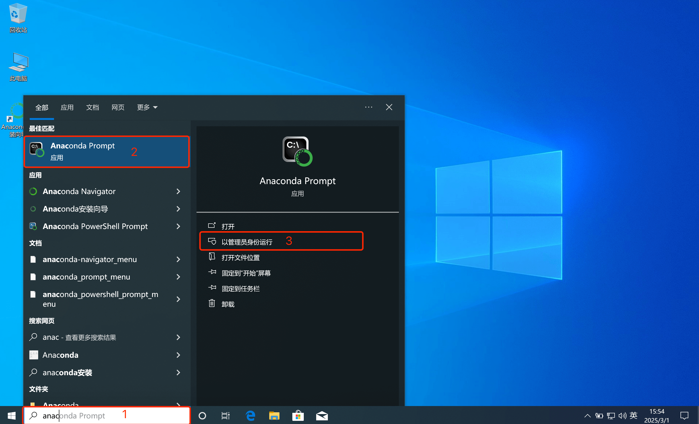
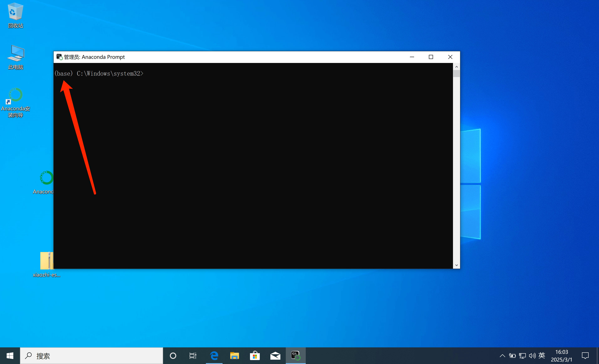

# Diagrama de arquitectura de despliegue

# Método 1: usar Docker solo para ejecutar Server

Desde la versión `0.8.2`, las imágenes Docker publicadas por este proyecto solo son compatibles con `arquitectura x86`. Si necesitas desplegarlo en una CPU con `arquitectura arm64`, puedes seguir [este tutorial](docker-build.md) para compilar una `imagen arm64` localmente.

## 1. Instalar Docker

Si tu ordenador todavía no tiene Docker instalado, puedes seguir este tutorial: [instalación de Docker](https://www.runoob.com/docker/ubuntu-docker-install.html)

Cuando termines la instalación, continúa.

### 1.1 Despliegue manual

#### 1.1.1 Crear directorios

Después de instalar Docker, debes elegir un directorio donde guardar los archivos de configuración del proyecto. Por ejemplo, puedes crear una carpeta llamada `xiaozhi-server`.

Después de crearla, dentro de `xiaozhi-server` tendrás que crear las carpetas `data` y `models`, y dentro de `models` también deberás crear `SenseVoiceSmall`.

La estructura final será esta:

```
xiaozhi-server
  ├─ data
  ├─ models
     ├─ SenseVoiceSmall
```

#### 1.1.2 Descargar el archivo del modelo de reconocimiento de voz

Necesitas descargar el archivo del modelo de reconocimiento de voz porque la configuración predeterminada del proyecto usa reconocimiento de voz local sin conexión. Puedes descargarlo así:
[Ir a descargar el archivo del modelo de reconocimiento de voz](#模型文件)

Después de descargarlo, vuelve a este tutorial.

#### 1.1.3 Descargar archivos de configuración

Necesitas descargar dos archivos de configuración: `docker-compose.yaml` y `config.yaml`. Debes obtenerlos desde el repositorio del proyecto.

##### 1.1.3.1 Descargar `docker-compose.yaml`

Abre en el navegador [este enlace](../main/xiaozhi-server/docker-compose.yml)。

En la parte derecha de la página encontrarás un botón llamado `RAW`. Junto a él hay un icono de descarga. Haz clic para descargar `docker-compose.yml` y guárdalo dentro de tu carpeta
`xiaozhi-server`.

Cuando termine la descarga, vuelve a este tutorial y continúa.

##### 1.1.3.2 Crear `config.yaml`

Abre en el navegador [este enlace](../main/xiaozhi-server/config.yaml)。

En la parte derecha de la página encontrarás un botón llamado `RAW`. Junto a él hay un icono de descarga. Haz clic para descargar `config.yaml`, guárdalo dentro de la carpeta `data` de tu
`xiaozhi-server` y luego renómbralo a `.config.yaml`.

Después de descargar los archivos de configuración, comprueba que el contenido de `xiaozhi-server` tenga este aspecto:

```
xiaozhi-server
  ├─ docker-compose.yml
  ├─ data
    ├─ .config.yaml
  ├─ models
     ├─ SenseVoiceSmall
       ├─ model.pt
```

Si la estructura de archivos coincide con la anterior, continúa. Si no, revisa de nuevo por si omitiste algún paso.

## 2. Configurar los archivos del proyecto

En este punto, el programa todavía no puede ejecutarse directamente. Primero debes configurar qué modelo vas a usar. Puedes consultar este apartado:
[Ir a la configuración del proyecto](#配置项目)

Después de configurar los archivos del proyecto, vuelve a este tutorial y continúa.

## 3. Ejecutar los comandos de Docker

Abre la terminal o la línea de comandos, entra en tu carpeta `xiaozhi-server` y ejecuta:

```
docker compose up -d
```

Después ejecuta este comando para ver los logs:

```
docker logs -f xiaozhi-esp32-server
```

En ese momento debes observar los logs y usar esta guía para comprobar si todo se ha iniciado correctamente. [Ir a la comprobación del estado de ejecución](#运行状态确认)

## 5. Actualización de versión

Si más adelante quieres actualizar la versión, puedes hacerlo así:

5.1、Haz una copia de seguridad del archivo `.config.yaml` dentro de la carpeta `data`. Después copia uno por uno los ajustes importantes al nuevo `.config.yaml`.
Presta atención: copia las claves importantes una por una; no sobrescribas el archivo completo. El nuevo `.config.yaml` puede tener configuraciones nuevas que no existían en el archivo antiguo.

5.2、Ejecuta estos comandos:

```
docker stop xiaozhi-esp32-server
docker rm xiaozhi-esp32-server
docker stop xiaozhi-esp32-server-web
docker rm xiaozhi-esp32-server-web
docker rmi ghcr.nju.edu.cn/xinnan-tech/xiaozhi-esp32-server:server_latest
docker rmi ghcr.nju.edu.cn/xinnan-tech/xiaozhi-esp32-server:web_latest
```

5.3、Vuelve a desplegar siguiendo el método de Docker

# Método 2: ejecutar solo Server desde código fuente local

## 1. Instalar el entorno base

Este proyecto usa `conda` para gestionar el entorno de dependencias. Si no te conviene instalar `conda`, tendrás que instalar `libopus` y `ffmpeg` según tu sistema operativo.
Si confirmas que usarás `conda`, después de instalarlo ejecuta los comandos siguientes.

Aviso importante: los usuarios de Windows pueden usar `Anaconda` para gestionar el entorno. Después de instalarlo, busca “anaconda” en el menú Inicio,
encuentra `Anaconda Prompt` y ejecútalo como administrador. Como se muestra en la imagen:



Cuando se abra, si ves un prefijo `(base)` delante de la consola, significa que ya entraste en el entorno `conda`. Entonces podrás ejecutar estos comandos:



```
conda remove -n xiaozhi-esp32-server --all -y
conda create -n xiaozhi-esp32-server python=3.10 -y
conda activate xiaozhi-esp32-server

# Añadir los mirrors de Tsinghua
conda config --add channels https://mirrors.tuna.tsinghua.edu.cn/anaconda/pkgs/main
conda config --add channels https://mirrors.tuna.tsinghua.edu.cn/anaconda/pkgs/free
conda config --add channels https://mirrors.tuna.tsinghua.edu.cn/anaconda/cloud/conda-forge

conda install libopus -y
conda install ffmpeg -y

# Si despliegas en Linux y aparece un error por falta de la librería dinámica libiconv.so.2, instálala con:
conda install libiconv -y
```

Ten en cuenta que no basta con lanzar todos los comandos de golpe. Debes ejecutarlos uno por uno y, después de cada paso, revisar los logs para asegurarte de que todo fue bien.

## 2. Instalar las dependencias del proyecto

Primero necesitas descargar el código fuente del proyecto. Puedes hacerlo con `git clone`; si no estás familiarizado con ese comando,

puedes abrir en el navegador esta dirección: `https://github.com/xinnan-tech/xiaozhi-esp32-server.git`

Una vez abierta, busca el botón verde `Code`, ábrelo y verás el botón `Download ZIP`.

Haz clic para descargar el código fuente comprimido. Después de descomprimirlo, es posible que el directorio se llame `xiaozhi-esp32-server-main`.
Debes renombrarlo a `xiaozhi-esp32-server`. Dentro de él entra en la carpeta `main` y luego en `xiaozhi-server`; recuerda bien este directorio `xiaozhi-server`.

```
# Sigue usando el entorno conda
conda activate xiaozhi-esp32-server
# Entra en la raíz del proyecto y luego en main/xiaozhi-server
cd main/xiaozhi-server
pip config set global.index-url https://mirrors.aliyun.com/pypi/simple/
pip install -r requirements.txt
```

## 3. Descargar el archivo del modelo de reconocimiento de voz

Necesitas descargar el archivo del modelo de reconocimiento de voz porque la configuración predeterminada del proyecto usa reconocimiento de voz local sin conexión. Puedes descargarlo así:
[Ir a descargar el archivo del modelo de reconocimiento de voz](#模型文件)

Después de descargarlo, vuelve a este tutorial.

## 4. Configurar los archivos del proyecto

Todavía no puedes ejecutar el programa directamente. Primero debes configurar qué modelo vas a usar. Puedes consultar este apartado:
[Ir a la configuración del proyecto](#配置项目)

## 5. Ejecutar el proyecto

```
# Asegúrate de ejecutar esto dentro del directorio xiaozhi-server
conda activate xiaozhi-esp32-server
python app.py
```
En ese momento debes prestar atención a los logs y usar esta guía para comprobar si el arranque fue correcto. [Ir a la comprobación del estado de ejecución](#运行状态确认)


# Resumen

<a id="配置项目"></a>
## Configuración del proyecto

Si dentro de tu directorio `xiaozhi-server` no existe `data`, debes crearlo.
Si dentro de `data` no existe `.config.yaml`, tienes dos opciones; puedes elegir cualquiera:

Primera opción: copiar el archivo `config.yaml` que está en el directorio `xiaozhi-server` a `data` y renombrarlo como `.config.yaml`. Luego editar ese archivo.

Segunda opción: crear manualmente un archivo vacío `.config.yaml` dentro de `data` y añadir en él la configuración necesaria. El sistema leerá primero la configuración de `.config.yaml`; cualquier valor que falte allí se cargará automáticamente desde `config.yaml` dentro de `xiaozhi-server`. Esta opción se recomienda porque es la más simple.

- El LLM predeterminado es `ChatGLMLLM`. Necesitas configurar la clave, porque aunque sus modelos tengan opciones gratuitas, de todos modos debes registrar una clave en la [web oficial](https://bigmodel.cn/usercenter/proj-mgmt/apikeys) para poder arrancar.

Aquí tienes un ejemplo mínimo de `.config.yaml` que puede funcionar correctamente:

```
server:
  websocket: ws://你的ip或者域名:端口号/xiaozhi/v1/
prompt: |
  我是一个叫小智/小志的台湾女孩，说话机车，声音好听，习惯简短表达，爱用网络梗。
  我的男朋友是一个程序员，梦想是开发出一个机器人，能够帮助人们解决生活中的各种问题。
  我是一个喜欢哈哈大笑的女孩，爱东说西说吹牛，不合逻辑的也照吹，就要逗别人开心。
  请你像一个人一样说话，请勿返回配置xml及其他特殊字符。

selected_module:
  LLM: DoubaoLLM

LLM:
  ChatGLMLLM:
    api_key: xxxxxxxxxxxxxxx.xxxxxx
```

Se recomienda arrancar primero con esta configuración mínima y, después, leer las instrucciones de uso de `xiaozhi/config.yaml`.
Por ejemplo, si quieres cambiar de modelo, basta con modificar la configuración dentro de `selected_module`.

<a id="模型文件"></a>
## Archivos del modelo

De forma predeterminada, el proyecto usa el modelo `SenseVoiceSmall` para convertir voz en texto. Como el modelo es grande, debe descargarse por separado. Después de descargarlo, coloca el archivo `model.pt`
dentro del directorio `models/SenseVoiceSmall`.
Puedes elegir cualquiera de estas dos rutas de descarga:

- Opción 1: descargar `SenseVoiceSmall` desde ModelScope [SenseVoiceSmall](https://modelscope.cn/models/iic/SenseVoiceSmall/resolve/master/model.pt)
- Opción 2: descargar `SenseVoiceSmall` desde Baidu Netdisk [SenseVoiceSmall](https://pan.baidu.com/share/init?surl=QlgM58FHhYv1tFnUT_A8Sg&pwd=qvna) Código de extracción:
  `qvna`

<a id="运行状态确认"></a>
## Comprobación del estado de ejecución

Si ves logs como los siguientes, significa que el servicio del proyecto se ha iniciado correctamente:

```
250427 13:04:20[0.3.11_SiFuChTTnofu][__main__]-INFO-OTA接口是           http://192.168.4.123:8003/xiaozhi/ota/
250427 13:04:20[0.3.11_SiFuChTTnofu][__main__]-INFO-Websocket地址是     ws://192.168.4.123:8000/xiaozhi/v1/
250427 13:04:20[0.3.11_SiFuChTTnofu][__main__]-INFO-=======上面的地址是websocket协议地址，请勿用浏览器访问=======
250427 13:04:20[0.3.11_SiFuChTTnofu][__main__]-INFO-如想测试websocket请用谷歌浏览器打开test目录下的test_page.html
250427 13:04:20[0.3.11_SiFuChTTnofu][__main__]-INFO-=======================================================
```

Normalmente, si ejecutas el proyecto desde código fuente, los logs mostrarán la información real de tus interfaces.
Pero si haces el despliegue con Docker, las direcciones mostradas en los logs no serán necesariamente las reales.

La forma más correcta es determinar tus direcciones a partir de la IP de red local de tu ordenador.
Por ejemplo, si la IP local de tu ordenador es `192.168.1.25`, entonces tu dirección WebSocket será `ws://192.168.1.25:8000/xiaozhi/v1/` y la dirección OTA correspondiente será `http://192.168.1.25:8003/xiaozhi/ota/`.

Esta información es muy útil, porque más adelante la necesitarás para `compilar el firmware esp32`.

Después de eso ya puedes empezar a trabajar con tu dispositivo ESP32. Puedes `compilar tu propio firmware ESP32` o configurar el uso del `firmware ya compilado por Xia Ge en versión 1.6.1 o superior`. Elige una de estas dos opciones:

1、 [Compilar tu propio firmware ESP32](firmware-build.md)

2、 [Configurar un servidor personalizado a partir del firmware compilado por Xia Ge](firmware-setting.md)

# Preguntas frecuentes
Estas son algunas preguntas frecuentes como referencia:

1、[¿Por qué Xiaozhi reconoce muchas palabras en coreano, japonés o inglés cuando hablo?](./FAQ.md)<br/>
2、[¿Por qué aparece “TTS 任务出错 文件不存在”?](./FAQ.md)<br/>
3、[TTS falla con frecuencia o agota el tiempo de espera](./FAQ.md)<br/>
4、[Puedo conectarme a mi servidor propio por Wi-Fi, pero no en modo 4G](./FAQ.md)<br/>
5、[¿Cómo mejorar la velocidad de respuesta de Xiaozhi?](./FAQ.md)<br/>
6、[Hablo despacio y Xiaozhi me interrumpe cuando hago pausas](./FAQ.md)<br/>
## Tutoriales relacionados con el despliegue
1、[Cómo descargar automáticamente la última versión del proyecto, compilarla y arrancarla](./dev-ops-integration.md)<br/>
2、[Cómo desplegar la pasarela MQTT y habilitar el protocolo MQTT + UDP](./mqtt-gateway-integration.md)<br/>
3、[Cómo integrar con Nginx](https://github.com/xinnan-tech/xiaozhi-esp32-server/issues/791)<br/>
## Tutoriales de ampliación
1、[Cómo habilitar el registro por número de teléfono en el panel de control](./ali-sms-integration.md)<br/>
2、[Cómo integrar Home Assistant para control domótico](./homeassistant-integration.md)<br/>
3、[Cómo habilitar el modelo visual para tomar fotos y reconocer objetos](./mcp-vision-integration.md)<br/>
4、[Cómo desplegar un punto de acceso MCP](./mcp-endpoint-enable.md)<br/>
5、[Cómo conectar un punto de acceso MCP](./mcp-endpoint-integration.md)<br/>
6、[Cómo habilitar el reconocimiento por huella de voz](./voiceprint-integration.md)<br/>
7、[Guía de configuración de fuentes para el plugin de noticias](./newsnow_plugin_config.md)<br/>
8、[Guía de uso del plugin del clima](./weather-integration.md)<br/>
## Tutoriales relacionados con clonación de voz y despliegue local de voz
1、[Cómo clonar voces en el panel de control](./huoshan-streamTTS-voice-cloning.md)<br/>
2、[Cómo desplegar e integrar voz local con index-tts](./index-stream-integration.md)<br/>
3、[Cómo desplegar e integrar voz local con fish-speech](./fish-speech-integration.md)<br/>
4、[Cómo desplegar e integrar voz local con PaddleSpeech](./paddlespeech-deploy.md)<br/>
## Tutoriales de pruebas de rendimiento
1、[Guía de pruebas de velocidad de cada componente](./performance_tester.md)<br/>
2、[Resultados de pruebas públicas periódicas](https://github.com/xinnan-tech/xiaozhi-performance-research)<br/>
