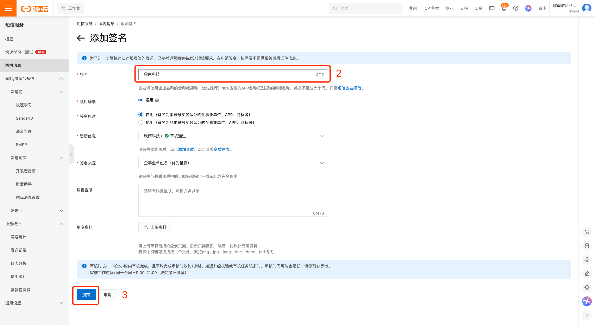
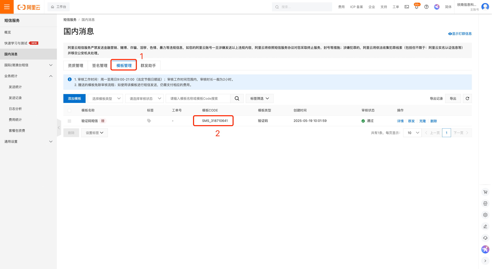
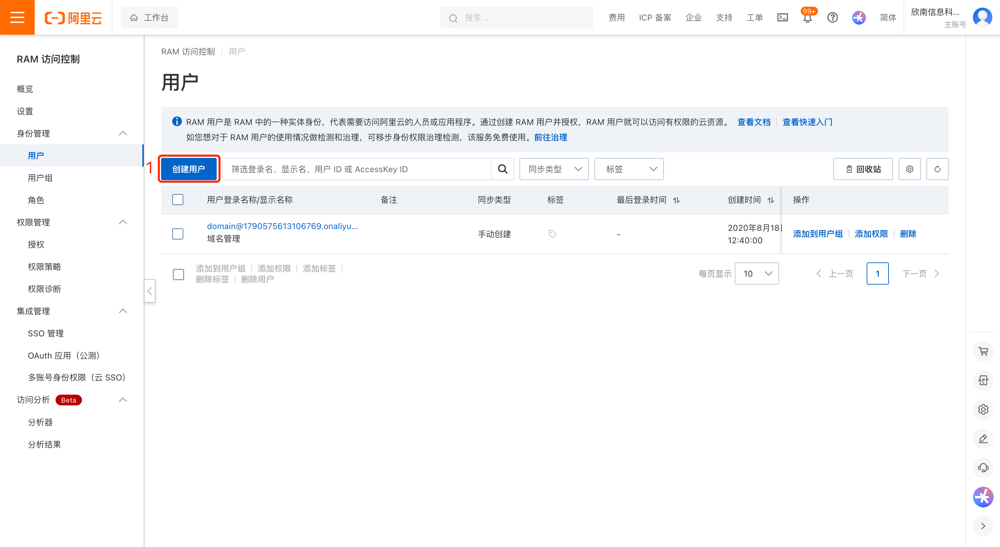
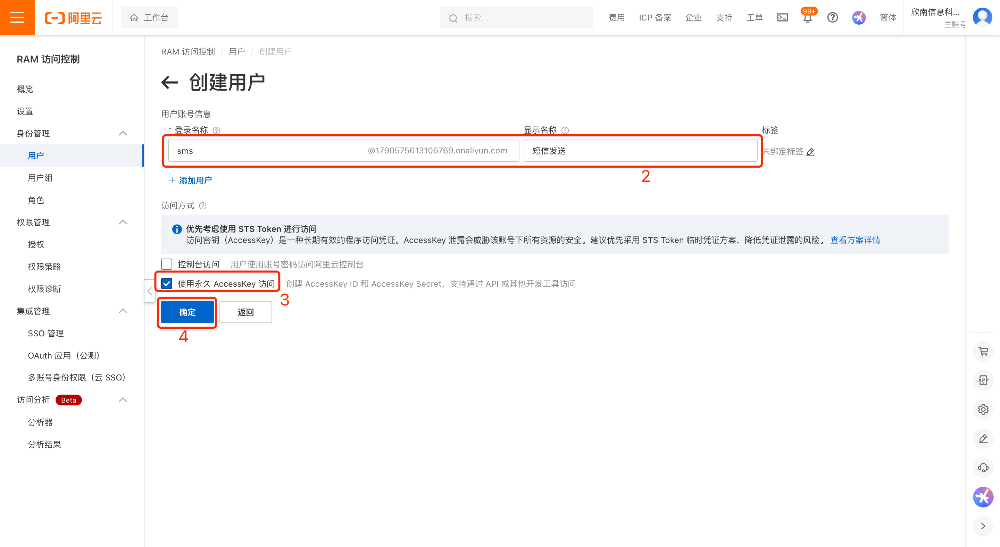
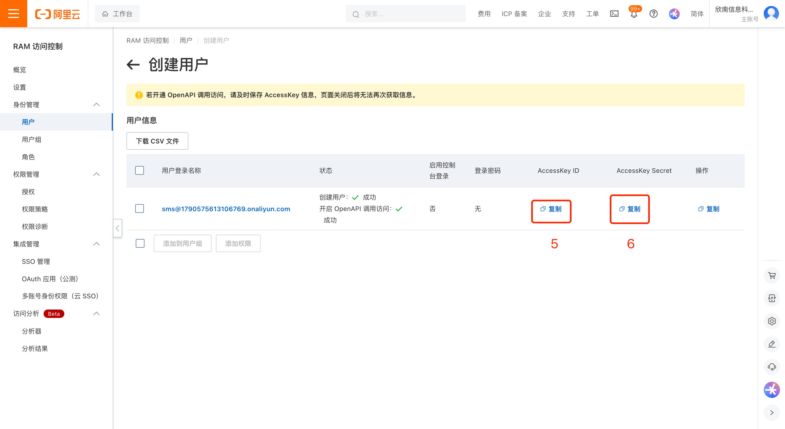
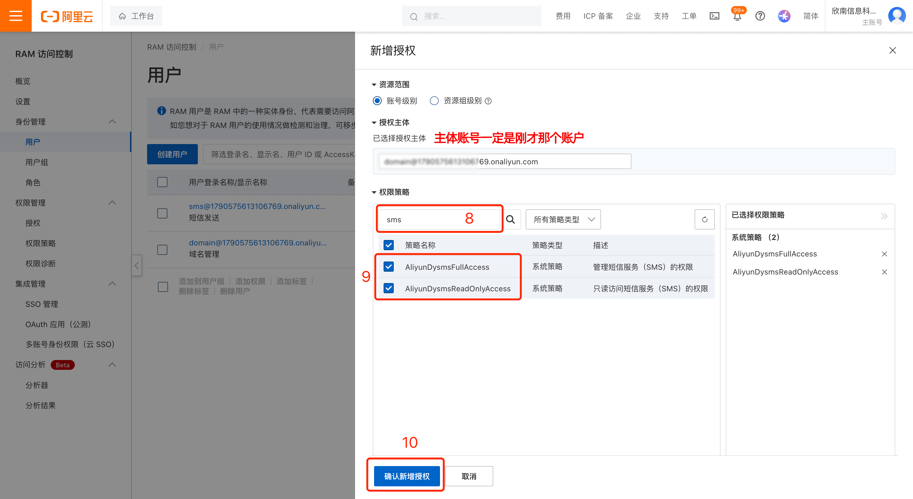
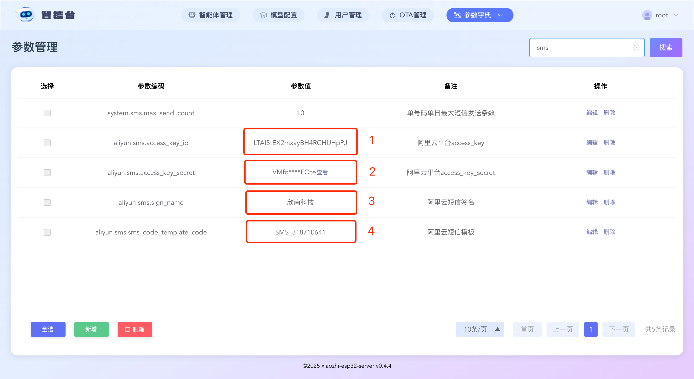
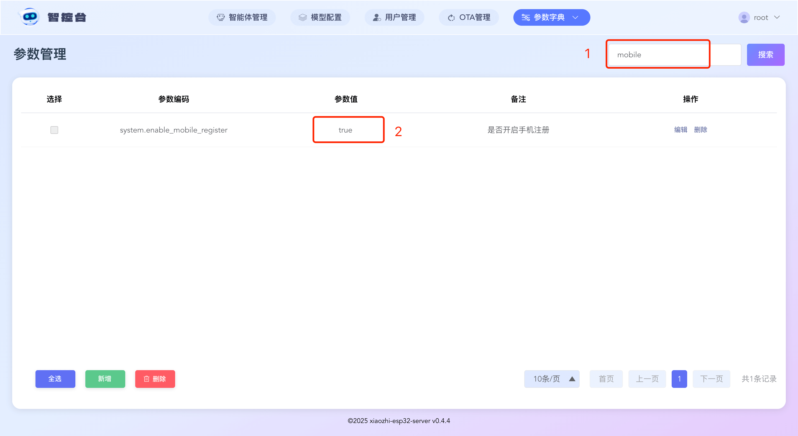

# Guía de integración de SMS de Alibaba Cloud

Inicia sesión en la consola de Alibaba Cloud y entra en la página de “Servicio de SMS”: https://dysms.console.aliyun.com/overview

## Paso 1: añadir la firma

Con los pasos anteriores obtendrás la firma. Escríbela en el parámetro `aliyun.sms.sign_name` del panel de control.

## Paso 2: añadir la plantilla

Con los pasos anteriores obtendrás el código de la plantilla. Escríbelo en el parámetro `aliyun.sms.sms_code_template_code` del panel de control.

Atención: la firma tarda 7 días laborables. Los mensajes solo podrán enviarse correctamente cuando el operador haya aprobado el registro.

Atención: la firma tarda 7 días laborables. Los mensajes solo podrán enviarse correctamente cuando el operador haya aprobado el registro.

Atención: la firma tarda 7 días laborables. Los mensajes solo podrán enviarse correctamente cuando el operador haya aprobado el registro.

Puedes continuar con los pasos siguientes una vez que la aprobación se haya completado.

## Paso 3: crear una cuenta de SMS y habilitar permisos

Inicia sesión en la consola de Alibaba Cloud y entra en la página de “Control de acceso”: https://ram.console.aliyun.com/overview?activeTab=overview

Con los pasos anteriores obtendrás `access_key_id` y `access_key_secret`. Escríbelos en los parámetros `aliyun.sms.access_key_id` y `aliyun.sms.access_key_secret` del panel de control.
## Paso 4: activar el registro por teléfono móvil

1. En condiciones normales, después de completar toda la información anterior, deberías ver este resultado. Si no aparece, probablemente falte algún paso.

2. Habilita el registro para usuarios que no sean administradores poniendo el parámetro `server.allow_user_register` en `true`

3. Habilita el registro por teléfono móvil poniendo el parámetro `server.enable_mobile_register` en `true`

