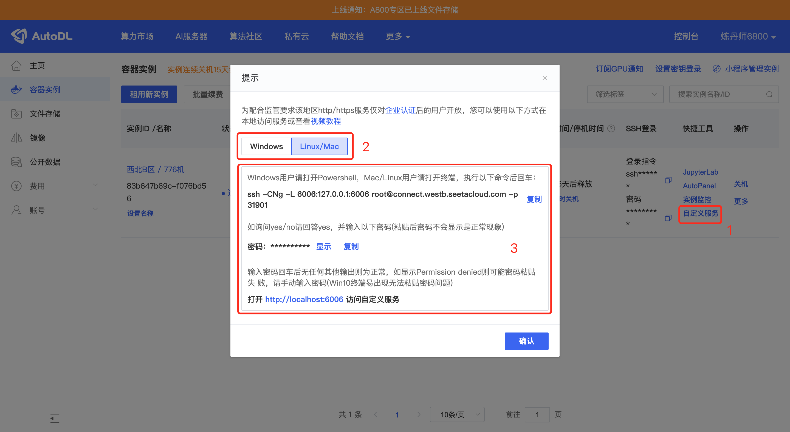
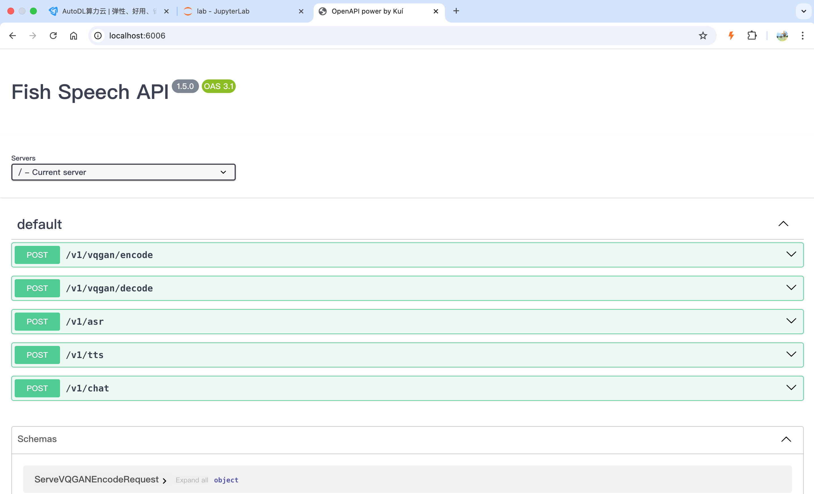

Inicia sesión en AutoDL y alquila una imagen.
Selecciona esta imagen:
```
PyTorch / 2.1.0 / 3.10(ubuntu22.04) / cuda 12.1
```

Cuando la máquina inicie, habilita la aceleración académica:
```
source /etc/network_turbo
```

Entra en el directorio de trabajo:
```
cd autodl-tmp/
```

Clona el proyecto:
```
git clone https://gitclone.com/github.com/fishaudio/fish-speech.git ; cd fish-speech
```

Instala las dependencias:
```
pip install -e.
```

Si aparece un error, instala `portaudio`:
```
apt-get install portaudio19-dev -y
```

Después de instalarlo, ejecuta:
```
pip install torch==2.3.1 torchvision==0.18.1 torchaudio==2.3.1 --index-url https://download.pytorch.org/whl/cu121
```

Descarga el modelo:
```
cd tools
python download_models.py 
```

Cuando termine la descarga, inicia la API:
```
python -m tools.api_server --listen 0.0.0.0:6006 
```

Después abre en el navegador la página de instancias de AutoDL:
```
https://autodl.com/console/instance/list
```

Como se muestra en la imagen, haz clic en el botón `自定义服务` de la máquina que acabas de crear para habilitar el reenvío de puertos.


Cuando termines de configurar el reenvío de puertos, abre `http://localhost:6006/` en tu equipo local y podrás acceder a la API de fish-speech.



Si usas un despliegue de un solo módulo, la configuración principal es la siguiente:
```
selected_module:
  TTS: FishSpeech
TTS:
  FishSpeech:
    reference_audio: ["config/assets/wakeup_words.wav",]
    reference_text: ["哈啰啊，我是小智啦，声音好听的台湾女孩一枚，超开心认识你耶，最近在忙啥，别忘了给我来点有趣的料哦，我超爱听八卦的啦",]
    api_key: "123"
    api_url: "http://127.0.0.1:6006/v1/tts"
```

Después reinicia el servicio.
