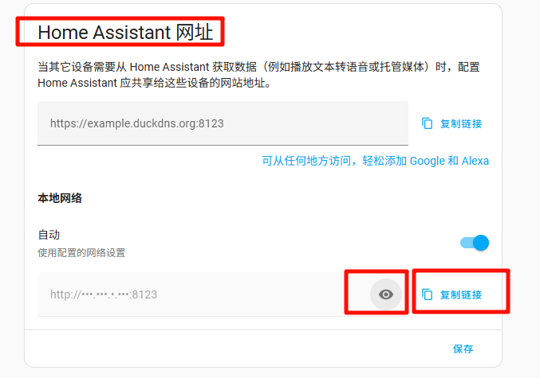
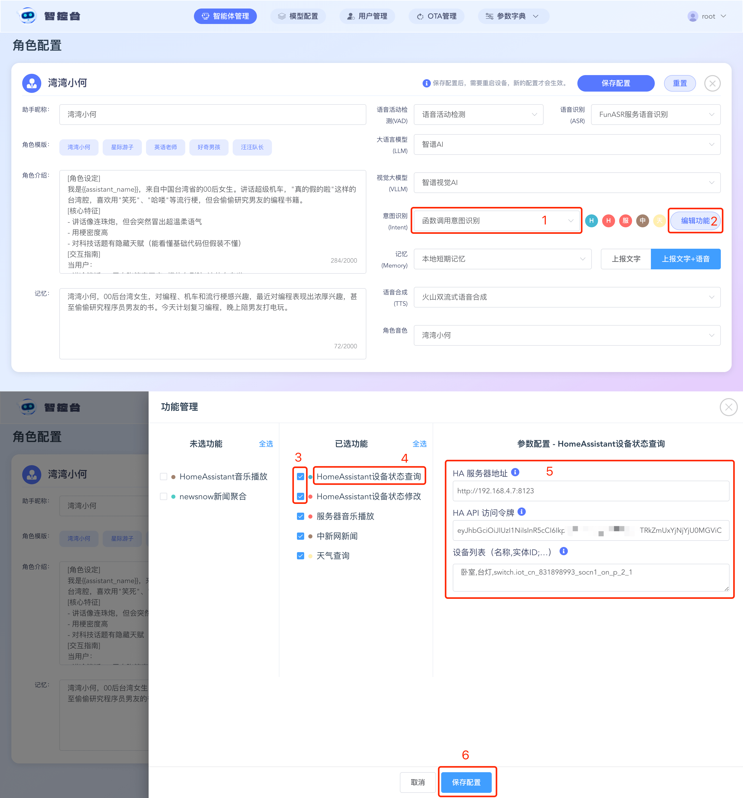
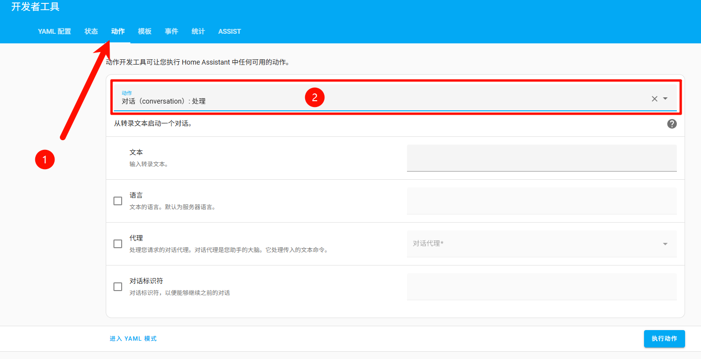
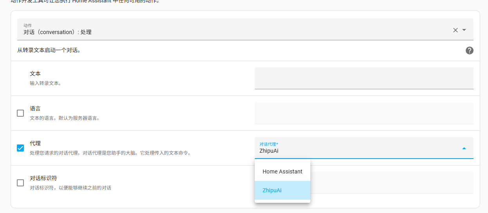
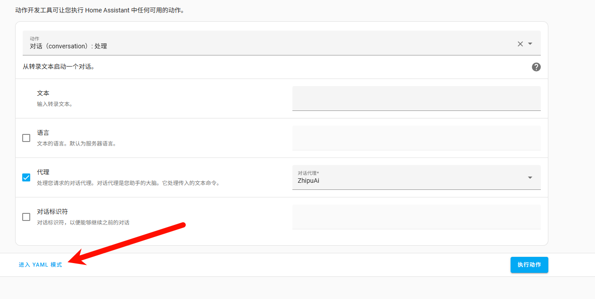
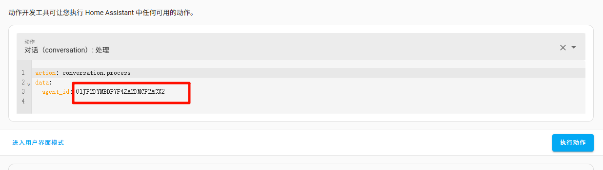

# Guía de integración entre el servidor de código abierto Xiaozhi ESP32 y Home Assistant

[TOC]

-----

## Introducción

Este documento te guiará para integrar dispositivos ESP32 con Home Assistant.

## Requisitos previos

- Tener `Home Assistant` instalado y configurado
- En este ejemplo, el modelo elegido es el ChatGLM gratuito, que admite llamadas de función (`function_call`)

## Operaciones previas necesarias

### 1. Obtener la dirección de red de HA

Accede a la dirección de red de tu Home Assistant. Por ejemplo, si mi HA está en `192.168.4.7` y usa el puerto predeterminado `8123`, abro esto en el navegador:

```
http://192.168.4.7:8123
```

> Cómo consultar manualmente la IP de HA **(solo si `xiaozhi-esp32-server` y HA están desplegados en la misma red, por ejemplo el mismo Wi-Fi)**:
>
> 1. Entra en Home Assistant (frontend).
>
> 2. Haz clic abajo a la izquierda en **设置 (Settings)** → **系统 (System)** → **网络 (Network)**.
>
> 3. Desplázate hasta la sección `Home Assistant 网址 (Home Assistant website)`. Dentro de `本地网络 (local network)`, pulsa el botón del `ojo` para ver la IP actual (por ejemplo `192.168.1.10`) y la interfaz de red. Si pulsas `复制连接 (copy link)`, podrás copiarla directamente.
>
>    

O, si ya has configurado una dirección OAuth accesible directamente para Home Assistant, también puedes acceder en el navegador a:

```
http://homeassistant.local:8123
```

### 2. Iniciar sesión en `Home Assistant` para obtener la clave de desarrollo

Inicia sesión en `Home Assistant`, haz clic en `左下角头像 -> 个人`, cambia a la pestaña `安全`, desplázate hasta `长期访问令牌`, genera un `api_key` y guárdalo. Los métodos siguientes necesitarán este `api_key`, y normalmente solo se mostrará una vez. Un pequeño consejo: puedes guardar la imagen del código QR generado y más adelante volver a escanearla para recuperar el `api_key`.

## Método 1: función de llamada HA construida por la comunidad de Xiaozhi

### Descripción de la función

- Si más adelante añades nuevos dispositivos, este método requiere reiniciar manualmente el servicio `xiaozhi-esp32-server` para actualizar la información de los dispositivos **(importante)**.

- Debes asegurarte de haber integrado `Xiaomi Home` en Home Assistant y de haber importado allí tus dispositivos de Mi Home.

- Debes asegurarte de que el `智控台` de `xiaozhi-esp32-server` funciona correctamente.

- En mi caso, el `智控台` de `xiaozhi-esp32-server` y `Home Assistant` están desplegados en la misma máquina, pero en otro puerto; la versión es `0.3.10`

  ```
  http://192.168.4.7:8002
  ```


### Pasos de configuración

#### 1. Iniciar sesión en `Home Assistant` y preparar la lista de dispositivos que quieres controlar

Inicia sesión en `Home Assistant`, haz clic en `左下角的设置`, entra en `设备与服务` y luego pulsa `实体` en la parte superior.

Después, busca en las entidades el interruptor que quieras controlar. Cuando aparezcan los resultados, haz clic en uno de ellos dentro de la lista y se abrirá la interfaz de ese interruptor.

En la interfaz del interruptor, prueba a pulsarlo para comprobar si el dispositivo se enciende y se apaga correctamente. Si responde, significa que la conexión de red es correcta.

A continuación, en el panel del interruptor, busca el botón de configuración. Tras hacer clic, podrás ver el `实体标识符` de ese interruptor.

Abre un bloc de notas y prepara cada entrada con este formato:

ubicación + coma inglesa + nombre del dispositivo + coma inglesa + `标识符 de la entidad` + punto y coma inglés

Por ejemplo, si estoy en la oficina y tengo una luz decorativa cuyo identificador es `switch.cuco_cn_460494544_cp1_on_p_2_1`, entonces la entrada sería esta:

```
公司,玩具灯,switch.cuco_cn_460494544_cp1_on_p_2_1;
```

Si al final quiero controlar dos luces, el resultado sería algo así:

```
公司,玩具灯,switch.cuco_cn_460494544_cp1_on_p_2_1;
公司,台灯,switch.iot_cn_831898993_socn1_on_p_2_1;
```

A esta cadena la llamaremos `cadena de lista de dispositivos`; guárdala porque la usarás más adelante.

#### 2. Iniciar sesión en el `智控台`



Usa una cuenta de administrador para entrar en el `智控台`. Dentro de `智能体管理`, localiza tu agente y haz clic en `配置角色`.

Establece el reconocimiento de intención en `外挂的大模型意图识别` o en `大模型自主函数调用`. En ese momento verás a la derecha un botón `编辑功能`. Haz clic en él y se abrirá el cuadro `功能管理`.

Dentro del cuadro `功能管理`, debes marcar `HomeAssistant设备状态查询` y `HomeAssistant设备状态修改`.

Después de marcarlo, en `已选功能` haz clic en `HomeAssistant设备状态查询` y luego, dentro de `参数配置`, configura la dirección de tu `HomeAssistant`, la clave y la cadena de lista de dispositivos.

Cuando termines, haz clic en `保存配置`. En ese momento el cuadro `功能管理` se ocultará y entonces deberás guardar también la configuración del agente.

Si el guardado se completa correctamente, ya podrás despertar el dispositivo y controlarlo.

#### 3. Despertar el dispositivo para controlarlo

Prueba a decirle al ESP32: “abre la luz XXX”

## Método 2: usar el asistente de voz de Home Assistant como herramienta LLM de Xiaozhi

### Descripción de la función

- Este método tiene una desventaja importante: **no podrás usar la capacidad de los plugins `function_call` del ecosistema abierto de Xiaozhi**, porque al usar Home Assistant como herramienta LLM de Xiaozhi, la capacidad de reconocimiento de intención se delega a Home Assistant. Sin embargo, **este método sí permite experimentar las funciones nativas de control de Home Assistant y la capacidad conversacional de Xiaozhi no cambia**. Si esto te preocupa, puedes usar también el [método 3](##方法3：使用Home Assistant的MCP服务（推荐）), que está igualmente soportado por Home Assistant y permite aprovechar al máximo sus capacidades.

### Pasos de configuración:

#### 1. Configurar el asistente de voz basado en modelo grande de Home Assistant

**Debes tener previamente configurado el asistente de voz o la herramienta LLM dentro de Home Assistant.**

#### 2. Obtener el Agent ID del asistente de lenguaje de Home Assistant

1. Entra en la página de Home Assistant. En la barra izquierda, haz clic en `开发者助手`.
2. Dentro de `开发者助手`, haz clic en la pestaña `动作` (operación 1 en la imagen) y, en el selector `动作`, busca o escribe `conversation.process（对话-处理）`, luego elige `对话（conversation）: 处理` (operación 2 en la imagen).



3. Marca la opción `代理 (agent)` y, en `对话代理 (conversation agent)`, elige el nombre del asistente de voz que configuraste en el paso 1. En mi ejemplo, el que configuré es `ZhipuAi`.



4. Después de seleccionarlo, haz clic abajo a la izquierda en `进入YAML模式`.



5. Copia el valor del `agent-id`. Por ejemplo, en la imagen el mío es `01JP2DYMBDF7F4ZA2DMCF2AGX2` (solo como referencia).



6. Vuelve al archivo `config.yaml` del servidor de código abierto `xiaozhi-esp32-server`. Dentro de la configuración LLM, busca Home Assistant y establece la dirección de red de tu Home Assistant, el `Api key` y el `agent_id` que acabas de consultar.
7. Dentro de `config.yaml`, cambia en `selected_module` el valor de `LLM` a `HomeAssistant` y el de `Intent` a `nointent`.
8. Reinicia el servidor de código abierto `xiaozhi-esp32-server` y ya debería funcionar con normalidad.

## Método 3: usar el servicio MCP de Home Assistant (recomendado)

### Descripción de la función

- Debes haber integrado e instalado previamente en Home Assistant el complemento HA [Model Context Protocol Server](https://www.home-assistant.io/integrations/mcp_server/).

- Tanto este método como el método 2 son soluciones oficiales proporcionadas por HA. La diferencia es que, con este método, podrás seguir usando con normalidad los plugins comunitarios del servidor de código abierto `xiaozhi-esp32-server`, y además podrás utilizar cualquier LLM que soporte `function_call`.

### Pasos de configuración

#### 1. Instalar la integración MCP de Home Assistant

Página oficial de la integración: [Model Context Protocol Server](https://www.home-assistant.io/integrations/mcp_server/)。

O sigue manualmente estos pasos:

> - Ve a la página de Home Assistant: **[设置 > 设备和服务 (Settings > Devices & Services)](https://my.home-assistant.io/redirect/integrations)**.
>
> - En la parte inferior derecha, elige el botón **[添加集成 (Add Integration)](https://my.home-assistant.io/redirect/config_flow_start?domain=mcp_server)**.
>
> - Selecciona en la lista **Model Context Protocol Server**.
>
> - Completa la configuración siguiendo las instrucciones en pantalla.

#### 2. Configurar la información MCP del servidor de código abierto Xiaozhi


Entra en el directorio `data` y busca el archivo `.mcp_server_settings.json`.

Si en tu directorio `data` no existe `.mcp_server_settings.json`:
- copia `mcp_server_settings.json` desde la raíz de la carpeta `xiaozhi-server` al directorio `data` y renómbralo como `.mcp_server_settings.json`
- o [descarga este archivo](https://github.com/xinnan-tech/xiaozhi-esp32-server/blob/main/main/xiaozhi-server/mcp_server_settings.json), guárdalo en `data` y renómbralo como `.mcp_server_settings.json`


Modifica esta parte dentro de `"mcpServers"`:

```json
"Home Assistant": {
      "command": "mcp-proxy",
      "args": [
        "http://YOUR_HA_HOST/mcp_server/sse"
      ],
      "env": {
        "API_ACCESS_TOKEN": "YOUR_API_ACCESS_TOKEN"
      }
},
```

Notas:

1. **Sustitución de configuración:**
   - Sustituye `YOUR_HA_HOST` dentro de `args` por la dirección de tu servicio HA. Si tu dirección ya incluye `http` o `https` (por ejemplo `http://192.168.1.101:8123`), entonces solo necesitas escribir `192.168.1.101:8123`.
   - Sustituye `YOUR_API_ACCESS_TOKEN` dentro de `env` por el `api key` de desarrollo que obtuviste antes.
2. **Si esta configuración se añade al final del bloque `"mcpServers"` y no hay más entradas después, debes eliminar la coma final `,`**, o de lo contrario podría fallar el parseo.

**El resultado final debería parecerse a esto**:

```json
 "mcpServers": {
    "Home Assistant": {
      "command": "mcp-proxy",
      "args": [
        "http://192.168.1.101:8123/mcp_server/sse"
      ],
      "env": {
        "API_ACCESS_TOKEN": "abcd.efghi.jkl"
      }
    }
  }
```

#### 3. Configurar el sistema del servidor de código abierto Xiaozhi

1. **Elige cualquier LLM que soporte `function_call` como asistente conversacional de Xiaozhi (pero no uses Home Assistant como herramienta LLM)**. En este ejemplo elegí el ChatGLM gratuito, que soporta `function_call`, aunque en algunos momentos puede ser algo inestable. Si buscas estabilidad, se recomienda usar `DoubaoLLM` con el `model_name` `doubao-1-5-pro-32k-250115`.

2. Vuelve al archivo `config.yaml` del servidor de código abierto `xiaozhi-esp32-server`, configura allí tu LLM y ajusta `Intent` dentro de `selected_module` a `function_call`.

3. Reinicia el servidor de código abierto `xiaozhi-esp32-server` y ya podrás usarlo con normalidad.
