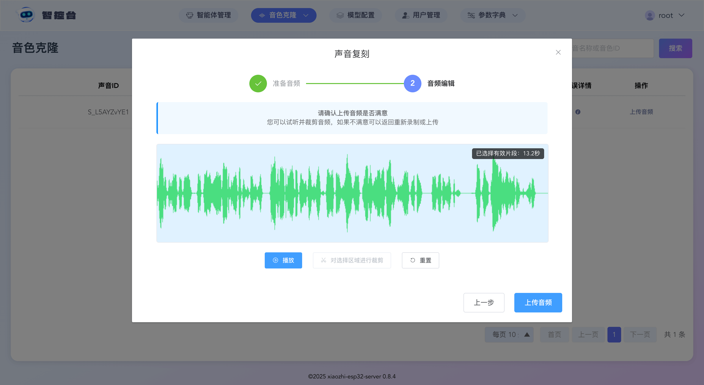
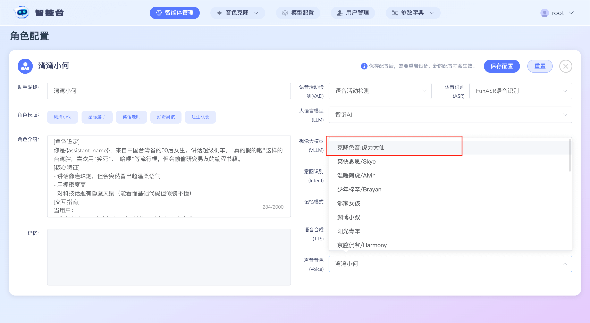

# Tutorial de configuración en el panel de control para síntesis de voz Huoshan de doble flujo + clonación de voz

Este tutorial se divide en 4 fases: preparación, configuración, clonación y uso. El objetivo principal es explicar cómo configurar desde el panel de control la síntesis de voz Huoshan de doble flujo junto con la clonación de voz.

## Fase 1: preparación
Primero, el superadministrador debe activar el servicio de Huoshan Engine y obtener el `App Id` y el `Access Token`. Por defecto, Huoshan Engine regala un recurso de voz. Ese recurso debe copiarse dentro de este proyecto.

Si quieres clonar varias voces, tendrás que comprar y habilitar varios recursos de voz. Solo necesitas copiar al proyecto el ID de voz de cada recurso (`S_xxxxx`) y luego asignarlo a las cuentas del sistema que lo usarán. A continuación tienes los pasos detallados:

### 1. Activar el servicio de Huoshan Engine
Visita https://console.volcengine.com/speech/app, crea una aplicación en la administración de aplicaciones y marca tanto el modelo grande de síntesis de voz como el modelo grande de clonación de voz.

### 2. Obtener el ID del recurso de voz
Visita https://console.volcengine.com/speech/service/9999 y copia estos tres datos: `App Id`, `Access Token` e ID de voz (`S_xxxxx`). Como se muestra en la imagen:

## Fase 2: configurar el servicio de Huoshan Engine

### 1. Rellenar la configuración de Huoshan Engine

Inicia sesión en el panel de control con una cuenta de superadministrador. Haz clic en `模型配置` en la parte superior y luego en `语音合成` en el lado izquierdo de la página de configuración de modelos. Busca “火山双流式语音合成”, pulsa editar, rellena el campo `应用ID` con tu `App Id` de Huoshan Engine y el campo `访问令牌` con tu `Access Token`. Después guarda los cambios.

### 2. Asignar el ID del recurso de voz a una cuenta del sistema

Inicia sesión en el panel de control con una cuenta de superadministrador, haz clic en `参数字典` en la parte superior y, dentro del menú desplegable, entra en la página `系统功能配置`. Marca `音色克隆` en la página y guarda la configuración. Después verás el botón `音色克隆` en el menú superior.

Inicia sesión en el panel de control con una cuenta de superadministrador y entra en `音色克隆` -> `音色资源`.

Haz clic en el botón de añadir nuevo y, en `平台名称`, selecciona “火山双流式语音合成”；

En `音色资源ID`, introduce el ID del recurso de voz de Huoshan Engine (`S_xxxxx`) y pulsa Intro；

En `归属账号`, elige la cuenta del sistema a la que quieras asignarlo. Puedes asignártelo a ti mismo. Después haz clic en guardar.

## Fase 3: clonación

Si al iniciar sesión y entrar en `音色克隆` -> `音色克隆` aparece el mensaje `您的账号暂无音色资源请联系管理员分配音色资源`, eso significa que en la segunda fase todavía no has asignado un ID de recurso de voz a esa cuenta. En ese caso, vuelve a la segunda fase y asígnalo a la cuenta correspondiente.

Si al iniciar sesión y entrar en `音色克隆` -> `音色克隆` puedes ver la lista de voces correspondientes, continúa.

En la lista verás los recursos de voz disponibles. Selecciona uno de ellos y haz clic en `上传音频`. Después de subir el audio, puedes preescuchar la voz o recortar un fragmento. Cuando lo confirmes, vuelve a pulsar `上传音频`.

Después de subir el audio, el recurso de voz pasará al estado “待复刻” en la lista. Haz clic en `立即复刻`. El resultado llegará al cabo de 1 o 2 segundos.

Si la clonación falla, pasa el cursor sobre el icono de “错误信息” para ver la causa del error.

Si la clonación se completa correctamente, el recurso de voz pasará al estado “训练成功” en la lista. En ese momento puedes usar el botón de edición de la columna `声音名称` para cambiar el nombre del recurso y facilitar su selección más adelante.

## Fase 4: uso

Haz clic en `智能体管理` en la parte superior, elige cualquier agente y pulsa `配置角色`.

En síntesis de voz (TTS), selecciona “火山双流式语音合成”. En la lista, busca el recurso de voz cuyo nombre incluya “克隆音色” (como se muestra en la imagen), selecciónalo y guarda.

A continuación, ya puedes despertar a Xiaozhi y hablar con él.
